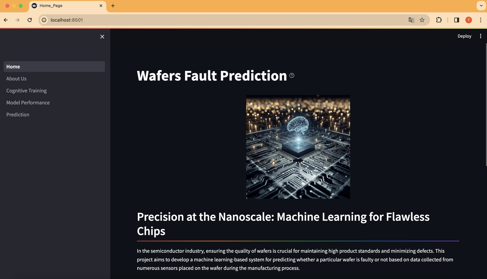
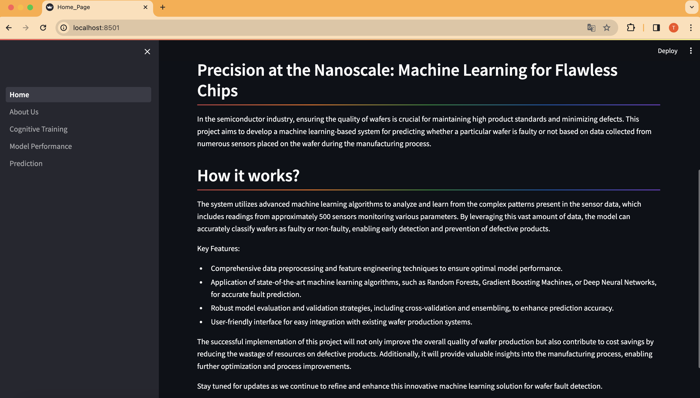
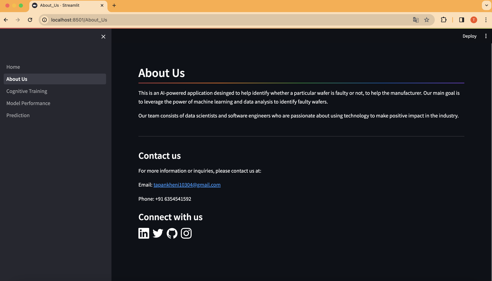
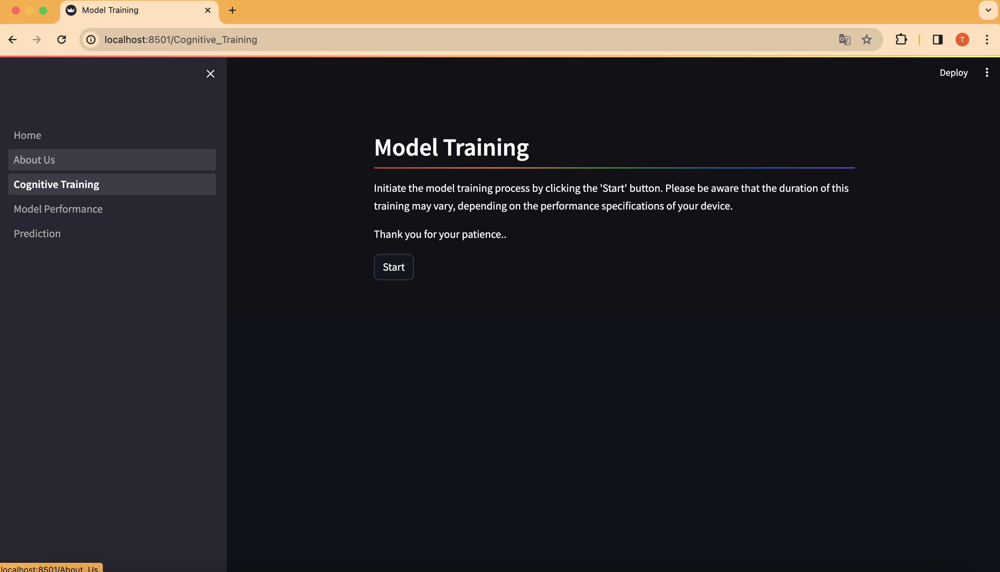
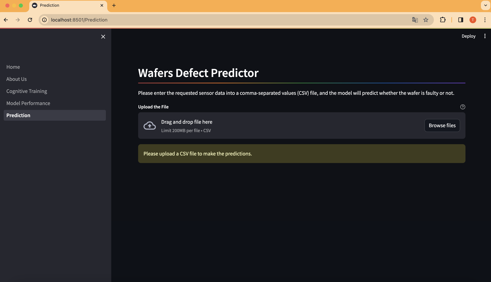
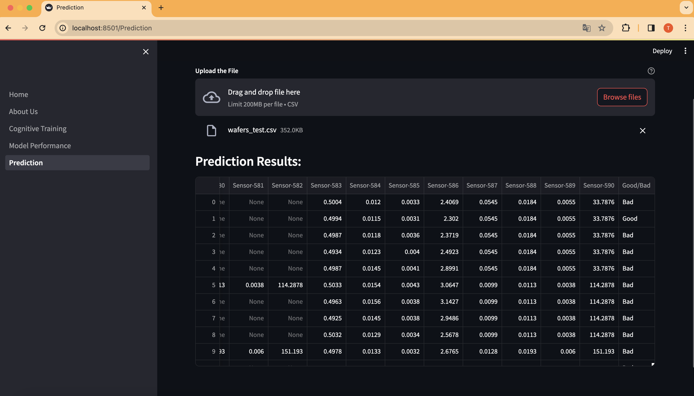

## Wafers Fault Prediction
In the semiconductor industry, ensuring the quality of wafers is crucial for maintaining high product standards and minimizing defects. This project aims to develop a machine learning-based system for predicting whether a particular wafer is faulty or not based on data collected from numerous sensors placed on the wafer during the manufacturing process.

<details open="open">
  <summary>Table of Contents</summary>
  <ol>
    <li>
      <a href="#Features">Features</a>
    </li>
    <li>
      <a href="#Technologies">Technologies</a>
    </li>
    <li>
      <a href="#Prototype">Protoype</a>
    </li>
    <li>
	    <a href = "#How-to-Start-Project">How to Start Project</a>
    </li>
    <li>
	    <a href = "#Contact-Us">Contact Us</a>
    </li>
    <li>
	    <a href = "#License">License</a>
    </li>
  </ol>
</details>

## Features
- Comprehensive data preprocessing and feature engineering techniques to ensure optimal model performance.
- Application of state-of-the-art machine learning algorithms, such as Random Forests, Gradient Boosting Machines, or Deep Neural Networks, for accurate fault prediction.
- User-friendly interface where user can upload a file consisting sensor data of .csv format for easy integration with existing wafer production systems.

## Technologies
- Python
- Streamlit
- Catboost
- Matplotlib
- MongoDB

## Prototype:

<div style="display:flex; flex-wrap:wrap; gap:2%; justify-content:center;">






</div>

## How to Start Project

Follow these steps to get started with the project:

1. **Clone the Repository:**
   ```bash
   git clone <repository_link>
   ```
2. **Install Anaconda:**
   
   Make sure you have Anaconda installed on your system. If not, you can download and install it from the official website: https://www.anaconda.com/download/
   
4. **Create a Virtual Environment:**
   
   Create a new virtual environment using Python 3.9.6:

   ```bash
   conda create --name your_env_name python=3.9.6 -y
   ```
   Replace your_env_name with the desired name for your virtual environment.
   
   Activate the newly created environment:
   ```bash
   conda activate your_env_name
   ```
5. **Install Dependencies:**
   
   Install the project dependencies by running:
   ```bash
   pip install -r requirements.txt
   ```
   This command will install all the required packages listed in the requirements.txt file.

7. **Run the Streamlit App:**
   ```bash
   streamlit run Home.py
   ```
   This command will start the Streamlit app.

## Contact Us

To learn more about our system and how it can help to reduce cost, please reach out:

📧 tapankheni10304@gmail.com

## License

This project is licensed under the MIT License - see the [LICENSE](LICENSE) file for details.
